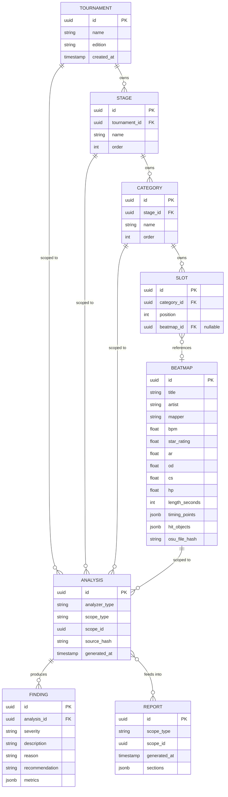

# Domain Model

Phase 2 deliverable: core entities, relationships, aggregate boundaries, and domain rules for the tournament/beatmap/analysis domain. Terms are defined in [03-terminology.md](03-terminology.md); this document defines their structure and behavior.

## Design decisions made in this phase

Two entities named as "potential" in the roadmap were deliberately *not* given their own persisted table:

- **Pool** is not a separate entity. A pool is the set of beatmaps assigned to a stage — i.e. it's the aggregate view of a `Stage`'s `Category` → `Slot` → `Beatmap` chain. Persisting it separately would duplicate derived data, which violates [Architecture Principle 5](04-architecture-principles.md#5-data-philosophy) (analysis/derived data must always be regenerable, never duplicated). "Pool" remains a term used in conversation and reports, backed by a query, not a table.
- **Analyzer** is not a persisted entity. An analyzer is code (a plugin implementing the analyzer interface), not data. What *is* persisted is the `Analysis` it produces. If we ever need a registry of available analyzers (for API discovery, e.g. "which analyzers can run on this scope"), that's a lightweight `AnalyzerDefinition` lookup, not a domain aggregate — deferred until the API phase needs it.

This keeps the model honest about what's source data, what's configuration, and what's derived — per the data philosophy, derived data is never a second source of truth.

## Core entities

### Tournament configuration (user-defined)

- **Tournament** — root of a competitive event. Holds identity (name, edition/year) and owns its `Stage`s.
- **Stage** — one round of a tournament (Qualifiers, RO16, Finals, ...). Belongs to exactly one Tournament. Has an explicit `order` (integer) since progression analysis depends on sequence, not on stage naming. Owns its `Category` list.
- **Category** — a mod/intent grouping within a stage (NM, HD, HR, DT, FM, TB, ...). Belongs to exactly one Stage. Has an explicit `order` within the stage. Owns its `Slot` list. Category *names* are free text — never an enum — per [Architecture Principle 4](04-architecture-principles.md#4-tournament-structure-is-always-user-defined).
- **Slot** — a single beatmap position within a category (e.g. "NM3"). Belongs to exactly one Category. Has a `position` (integer, e.g. 3). References zero or one `Beatmap` — a slot can exist unfilled (pool still being built) or filled.

### Source data (immutable)

- **Beatmap** — one playable map: one song + one difficulty. Holds metadata (title, artist, mapper, BPM, AR/OD/CS/HP, star rating, length, etc.), timing points, and hit objects. Immutable once imported. **Not owned by any Tournament** — a beatmap is shared, content-addressed source data that any number of Slots, across any number of Tournaments, can reference by ID. This matters: the same beatmap reused across pools must not be imported/duplicated per tournament.

### Derived data (regenerable)

- **Analysis** — the structured result of running one analyzer against a scope (a Tournament, Stage, Category, or Beatmap). Holds the analyzer identity/version, the scope it ran against, a `sourceHash` (hash of the input data + config it was computed from, enabling determinism checks and cache invalidation), and its `Finding`s.
- **Finding** — one observation produced by an analysis: severity, description, reason, recommendation, and the metric(s) backing it. Belongs to exactly one Analysis.
- **Report** — a human-readable document assembled from one or more Analyses for a given scope. Contains narrative sections (summary, findings, warnings, recommendations, statistics) and references its source Analyses — it does not duplicate their data, only narrates it.

> **Validation** is not a separate entity — it's a `Finding` whose severity is `warning`/`critical` rather than `info`. Modeling it as a Finding subtype (not a parallel hierarchy) avoids the two-trees problem of "is this a Finding or a Validation" and matches [Architecture Principle 9](04-architecture-principles.md#9-reports-speak-in-conclusions-not-raw-numbers): every finding already carries severity, reason, and recommendation.

## Entity Relationship Diagram

`scope_type` / `scope_id` on `ANALYSIS` and `REPORT` is a polymorphic reference (analogous to a tagged union) — an analysis can be scoped to a Tournament, Stage, Category, or Beatmap without needing four separate foreign keys or four separate tables. The analyzer interface receives a normalized view appropriate to its declared scope.

## Aggregate boundaries

Four aggregates, each with a clear consistency boundary and a single root:

1. **Tournament aggregate** — root: `Tournament`. Contains `Stage` → `Category` → `Slot`. These are edited together as one unit (reordering a stage, adding a category, assigning a beatmap to a slot are all tournament-configuration changes) and should be transactionally consistent. Slots reference Beatmaps **by ID only** — Beatmap is a separate aggregate, never embedded.
2. **Beatmap aggregate** — root: `Beatmap`. Standalone, immutable after import. No entity outside this aggregate ever mutates a Beatmap's fields.
3. **Analysis aggregate** — root: `Analysis`. Contains its `Finding`s. Immutable once generated (a re-run produces a new Analysis, not a mutation of an old one) — this is what makes `source_hash` meaningful: same hash should always reproduce the same Analysis.
4. **Report aggregate** — root: `Report`. References Analyses by ID; does not contain or duplicate Finding data, only narrative text and structured citations back to them.

Cross-aggregate references are always by ID, never by embedding — this is what lets Beatmaps be shared across Tournaments and lets Analyses be regenerated/discarded without touching the Tournament aggregate that triggered them.

## Domain rules

- A `Slot` belongs to exactly one `Category`; a `Category` belongs to exactly one `Stage`; a `Stage` belongs to exactly one `Tournament`. No orphaned configuration nodes.
- A `Slot` may be unfilled (`beatmap_id IS NULL`) — pools are built incrementally, and analysis must handle partially-filled pools without erroring (it should report missing coverage, not crash).
- A `Beatmap` is immutable once imported. Re-importing the same `.osu` file (same `osu_file_hash`) must not create a duplicate row — it resolves to the existing Beatmap.
- The same `Beatmap` may be referenced by Slots across multiple Tournaments and multiple Stages. There is no ownership relationship from Beatmap back to Tournament.
- `Stage.order` and `Category.order` are explicit integers, never inferred from name or insertion order — progression analysis depends on this sequence being unambiguous and user-controlled.
- An `Analysis` must be fully reproducible from its scope's current data plus its declared analyzer version — given the same inputs, re-running an analyzer must produce a `Finding` set equal to the stored one. If it doesn't, that's a determinism bug in the analyzer, not an expected variance ([Architecture Principle 6](04-architecture-principles.md#6-determinism)).
- A `Finding`'s severity, reason, and recommendation are required fields, not optional — a Finding without an explanation of *why* it matters is not a valid Finding per [Architecture Principle 9](04-architecture-principles.md#9-reports-speak-in-conclusions-not-raw-numbers).
- A `Report` must not contain data that doesn't trace back to at least one cited `Analysis` — reports narrate analysis output, they don't introduce new conclusions.
