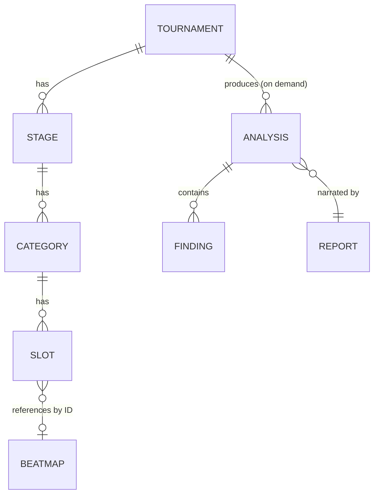

# API Specification

Phase 10 deliverable: the REST contract over the Tournament aggregate, the Beatmap aggregate, and the Analysis Engine's output. Full machine-readable contract: [docs/api/openapi.yaml](api/openapi.yaml) (OpenAPI 3.1). This document is the narrative companion — why the contract is shaped the way it is, not a restatement of the YAML.

Validated with `npx @redocly/cli lint docs/api/openapi.yaml` (zero errors, zero warnings) and exercised against a mock server (`npx @stoplight/prism-cli mock docs/api/openapi.yaml`) to confirm every operation, including request validation and the hand-written examples, actually serves.

## Resource model

This mirrors `docs/06-domain-model.md` exactly — the API surface does not introduce a resource shape the domain model doesn't already have. The one deliberate addition is `TournamentSummary`, a lighter projection of `Tournament` used only in list responses (no `stages`), so listing a hundred tournaments doesn't transfer a hundred full trees.

| Resource | Endpoint(s) | Notes |
|---|---|---|
| Tournament | `/tournaments`, `/tournaments/{id}` | Full read/write of the configuration aggregate |
| Stage | `/stages/{id}` | Read-only, flat |
| Category | `/categories/{id}` | Read-only, flat |
| Slot | `/slots/{id}/beatmap` | The one independently-mutable edge — beatmap assignment |
| Beatmap | `/beatmaps`, `/beatmaps/{id}` | Import (write-once) and lookup |
| Analysis | `/tournaments/{id}/analyses` | Computed on demand, not a stored collection |
| Report | `/tournaments/{id}/report` | Computed on demand, narrates Analyses |

## Why Stage and Category are flat, not nested under Tournament

`docs/06-domain-model.md`'s `Scope{Type, ID}` pattern means a Finding or Analysis already names a Stage or Category by ID alone — that's exactly how `internal/analysis.FindStage`/`FindCategory` resolve them. A client following a citation from `/tournaments/{id}/analyses` or a Report's `findings[].scope` has a Stage or Category ID and nothing else; making it walk back through `/tournaments/{tid}/stages/{sid}` would force it to look up the parent Tournament ID it was never given. `GET /stages/{stageId}` and `GET /categories/{categoryId}` resolve directly. This also keeps URI depth to the 2-3 levels the REST pattern guidance recommends — `/tournaments/{tournamentId}/stages/{stageId}/categories/{categoryId}/slots/{slotId}` was the rejected alternative.

Stage and Category have no independent `POST`/`PATCH`/`DELETE` — they're part of the Tournament aggregate's consistency boundary (`docs/06-domain-model.md`: "edited together as one unit"). The only structural mutation exposed independently is **slot assignment**, because filling slots happens incrementally over the life of a tournament, not at configuration time — `PUT /slots/{slotId}/beatmap` and its `DELETE` counterpart.

## Why Analyses and Reports are GET, not POST

Both `/tournaments/{id}/analyses` and `/tournaments/{id}/report` are read operations that *compute* their response rather than fetching a stored row. This is intentional, not a shortcut: `docs/04-architecture-principles.md` Principle 5 treats Analysis and Report as derived data that's "always be regenerable, never duplicated" — there's no `AnalysisRepository` or `ReportRepository`, by design. A GET is safe and idempotent for a fixed Tournament state, which is exactly the right semantic: calling it twice without changing the Tournament returns the same Analyses (same `source_hash`), and calling it after a Slot assignment changes returns fresh ones. Modeling this as `POST /tournaments/{id}/analyses:run` would imply a side effect or a stored job, neither of which exists.

## Why there is no `/validations` or `/comparisons` endpoint

The original roadmap (`pool-lab-plan.md` Phase 10) lists "Comparison" and "Validation" among possible endpoints. Neither is exposed:

- **Validation** isn't a separate entity in the domain model (`docs/06-domain-model.md`, reaffirmed in `docs/12-tournament-analyzers.md`'s "Why there is no ValidationAnalyzer") — it's a `Finding` whose severity is `warning`/`critical`. `GET /tournaments/{id}/analyses?severity=warning,critical` (or the Report's `warnings` section) *is* the validation view. A separate endpoint would just be a relabeled duplicate of data already returned.
- **Comparison** has no backing capability in the Analysis Engine — there is no `ComparisonAnalyzer`; cross-tournament comparison is listed under `pool-lab-plan.md`'s Future Ideas, not built. Exposing `/comparisons` now would put the API ahead of the engine, inverting `docs/04-architecture-principles.md`'s stated direction ("the Analysis Engine is the source of truth... they never drive design decisions"). When a comparison capability exists in the engine, the endpoint is a small addition; building it first would mean designing a contract for a computation that doesn't exist yet, and likely getting it wrong.

## Authentication

`BearerAuth` (HTTP Bearer) is declared in the spec but not globally required (`security: [{}, {BearerAuth: []}]` — the empty alternative makes it optional). This matches the project's current scope: a self-hosted, single-tenant analysis tool, not a multi-tenant SaaS. The scheme exists so a deployment that needs access control can require it without a breaking change to the contract — only the `security` requirement tightens, no endpoint shape changes.

## Pagination

Cursor-based, on every collection endpoint (`/tournaments`, `/beatmaps`, `/tournaments/{id}/analyses`): `?cursor=&limit=` in, `{data: [...], pagination: {next_cursor, has_more}}` out. Cursor-based over offset-based because Beatmap and Analysis collections are exactly the case the pattern favors — data that can grow continuously (more imports, more analyzer registrations) where a client paging through shouldn't see duplicated or skipped rows if the underlying set changes between requests, and an expensive `COUNT` isn't worth it for a self-hosted tool with no UI need to show "page 3 of 15". `limit` defaults to 20, capped at 100.

## Filtering and sorting

| Endpoint | Filters | Sort keys |
|---|---|---|
| `GET /tournaments` | `q` (name substring) | `name`, `-name` |
| `GET /beatmaps` | `q` (title/artist substring), `mapper`, `bpm_min`, `bpm_max` | `title`, `bpm`, `length_seconds` (and `-` prefixed) |
| `GET /tournaments/{id}/analyses` | `analyzer_name`, `scope_type`, `scope_id`, `severity` (comma-separated) | — (returned in Engine.Run's deterministic order: analyzer name, then scope ID) |

`severity` filters **Findings within an Analysis**, not whole Analyses — an Analysis with a mix of severities still appears, with only the matching Findings included, so a client filtering to `severity=critical` doesn't lose the `metrics`/`score` context that came with it.

## Versioning

URI-based (`/v1/...`), per the comparison in `references/versioning.md`: visible, simple to route, and lets a hypothetical `/v2` run alongside `/v1` rather than requiring every client to renegotiate a header. Given the project has no deployed clients yet, this is a low-cost default rather than a response to an existing compatibility problem.

**What's breaking (requires `/v2`):** removing/renaming a field, changing a field's type, adding a required request field, removing an endpoint, changing a status code for an existing scenario.
**What's not (ships within `/v1`):** new endpoints, new optional fields, new enum values additive to existing ones (clients must ignore unknown values), new response fields (clients must ignore unknown fields).

No deprecation has happened yet — there is only one version. When a `/v2` is needed, the policy is: announce in `pool-lab-plan.md` and via the `Deprecation`/`Sunset` response headers on `/v1`, keep `/v1` serving for at least one full release cycle, then 410 Gone.

## Error handling

RFC 7807 (`application/problem+json`) uniformly — `type`, `title`, `status`, `detail`, `instance`, plus an `errors[]` array for field-level validation failures (e.g. a `TournamentConfiguration` that violates `docs/07-tournament-configuration.md`'s schema). Three response shapes cover every error in the spec: `BadRequest` (400, malformed request), `ValidationError` (422, well-formed but domain-invalid), `NotFound` (404). `TooManyRequests` (429, with `Retry-After`) is declared on every operation as a rate-limiting placeholder — no rate limiter is implemented yet, but the contract reserves the response shape now so adding one later doesn't change any client-facing schema.

## What is explicitly not in scope for this phase

- **Server implementation.** This phase delivers the contract (OpenAPI spec + this document), validated by linting and a mock server — not Go HTTP handlers. Implementing them requires a `TournamentRepository` (doesn't exist yet; only `BeatmapRepository` does, see `docs/08-beatmap-import-pipeline.md`) and a routing/HTTP framework decision, both real implementation work distinct from designing the contract they'll implement.
- **GraphQL.** REST was chosen per `docs/05-stack-proposal.md`'s direction and because the resource model here is shallow and tree-shaped (a GraphQL query-shaping advantage matters most for deep, ragged graphs) — not revisited in this phase.
- **Webhooks / real-time updates.** Nothing in the roadmap calls for push notification of new Findings; on-demand GET is sufficient for the current single-organizer usage pattern.

## Testing checklist

- [x] `npx @redocly/cli lint docs/api/openapi.yaml` — 0 errors, 0 warnings
- [x] `npx @stoplight/prism-cli mock docs/api/openapi.yaml` — every operation in the spec registers and serves; spot-checked `GET /tournaments`, `DELETE /tournaments/{id}`, `POST /tournaments` (with both a valid and an invalid body, confirming the 422 Problem response), `GET /tournaments/{id}/report` (confirming the hand-written example renders)
- [ ] Contract tests against a real implementation — blocked on the server implementation called out above
