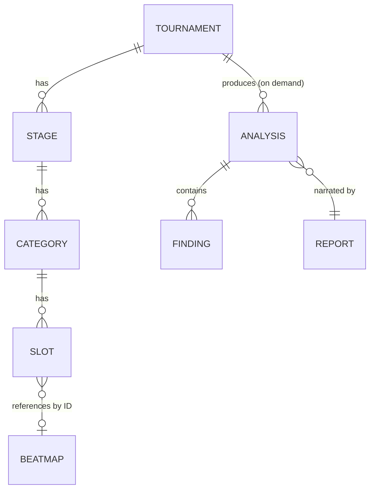

# API Specification

Phase 10 deliverable: the REST contract over the Tournament aggregate, the Beatmap aggregate, and the Analysis Engine's output. Full machine-readable contract: [docs/api/openapi.yaml](api/openapi.yaml) (OpenAPI 3.1). This document is the narrative companion — why the contract is shaped the way it is, not a restatement of the YAML.

**Status: implemented.** The contract is served by real Go HTTP handlers in `backend/internal/api/` (`router.go` registers every route on `net/http`'s `http.ServeMux`, Go 1.22+ method+wildcard patterns, mounted under `/v1`). The composition root is `backend/cmd/server/main.go`. The spec was originally validated by linting and a mock server before implementation (`npx @redocly/cli lint docs/api/openapi.yaml`, `npx @stoplight/prism-cli mock docs/api/openapi.yaml`); it is now additionally validated by the integration tests described in [Testing](#testing) below, which exercise the real handlers end to end.

## Resource model



This mirrors `docs/06-domain-model.md` exactly — the API surface does not introduce a resource shape the domain model doesn't already have. The one deliberate addition is `TournamentSummary`, a lighter projection of `Tournament` used only in list responses (no `stages`), so listing a hundred tournaments doesn't transfer a hundred full trees.

| Resource | Endpoint(s) | Handler | Notes |
|---|---|---|---|
| Tournament | `/tournaments`, `/tournaments/{id}` | `backend/internal/api/tournaments.go` | Full read/write of the configuration aggregate |
| Stage | `/stages/{id}` | `backend/internal/api/stages.go` | Read-only, flat |
| Category | `/categories/{id}` | `backend/internal/api/categories.go` | Read-only, flat |
| Slot | `/slots/{id}/beatmap` | `backend/internal/api/slots.go` | The one independently-mutable edge — beatmap assignment |
| Beatmap | `/beatmaps`, `/beatmaps/{id}` | `backend/internal/api/beatmaps.go` | Import (write-once) and lookup |
| Analysis | `/tournaments/{id}/analyses` | `backend/internal/api/analyses.go` | Computed on demand, not a stored collection |
| Report | `/tournaments/{id}/report` | `backend/internal/api/reports.go` | Computed on demand, narrates Analyses |

## Endpoints as implemented

`backend/internal/api/router.go` is the ground truth for route registration. Every route it registers matches `docs/api/openapi.yaml` exactly — path, method, and path-parameter names all line up one-to-one. There is no drift between the originally-proposed contract and what shipped.

| Method | Path | Operation |
|---|---|---|
| GET | `/v1/tournaments` | List tournaments |
| POST | `/v1/tournaments` | Create a tournament from a configuration |
| GET | `/v1/tournaments/{tournamentId}` | Get a tournament's full structure |
| PATCH | `/v1/tournaments/{tournamentId}` | Rename a tournament or change its edition |
| DELETE | `/v1/tournaments/{tournamentId}` | Delete a tournament |
| GET | `/v1/stages/{stageId}` | Get a stage |
| GET | `/v1/categories/{categoryId}` | Get a category |
| PUT | `/v1/slots/{slotId}/beatmap` | Assign a beatmap to a slot |
| DELETE | `/v1/slots/{slotId}/beatmap` | Clear a slot's beatmap |
| GET | `/v1/beatmaps` | List imported beatmaps |
| POST | `/v1/beatmaps` | Import a `.osu` file |
| GET | `/v1/beatmaps/{beatmapId}` | Get a beatmap |
| GET | `/v1/tournaments/{tournamentId}/analyses` | Run the Analysis Engine and return results |
| GET | `/v1/tournaments/{tournamentId}/report` | Build a narrative Report from the tournament's Analyses |

Request/response DTOs live in `backend/internal/api/dto.go` and are a direct, field-for-field mirror of the OpenAPI schemas (snake_case JSON; `dto.go`'s own comment states the intent explicitly: "matching docs/api/openapi.yaml's schemas exactly"). Domain-to-wire conversion is one-directional and explicit (`toTournamentDTO`, `toBeatmapDTO`, `toAnalysisDTO`, `toReportDTO`, etc.) — handlers never serialize domain types directly.

## Why Stage and Category are flat, not nested under Tournament

`docs/06-domain-model.md`'s `Scope{Type, ID}` pattern means a Finding or Analysis already names a Stage or Category by ID alone — that's exactly how `internal/analysis.FindStage`/`FindCategory` resolve them. A client following a citation from `/tournaments/{id}/analyses` or a Report's `findings[].scope` has a Stage or Category ID and nothing else; making it walk back through `/tournaments/{tid}/stages/{sid}` would force it to look up the parent Tournament ID it was never given. `GET /stages/{stageId}` and `GET /categories/{categoryId}` resolve directly, backed by `TournamentRepository.FindStageByID`/`FindCategoryByID` (`backend/internal/storage/memory/tournament_repository.go`), which walk every stored tournament's tree rather than requiring the caller to know the parent. This also keeps URI depth to the 2-3 levels the REST pattern guidance recommends — `/tournaments/{tournamentId}/stages/{stageId}/categories/{categoryId}/slots/{slotId}` was the rejected alternative.

Stage and Category have no independent `POST`/`PATCH`/`DELETE` — they're part of the Tournament aggregate's consistency boundary (`docs/06-domain-model.md`: "edited together as one unit"). The only structural mutation exposed independently is **slot assignment**, because filling slots happens incrementally over the life of a tournament, not at configuration time — `PUT /slots/{slotId}/beatmap` and its `DELETE` counterpart, both implemented in `backend/internal/api/slots.go` against `TournamentRepository.AssignSlotBeatmap`/`ClearSlotBeatmap`.

## Why Analyses and Reports are GET, not POST

Both `/tournaments/{id}/analyses` and `/tournaments/{id}/report` are read operations that *compute* their response rather than fetching a stored row. This is implemented exactly as designed: `ListTournamentAnalyses` and `GetTournamentReport` (`backend/internal/api/analyses.go`, `backend/internal/api/reports.go`) share a `runEngine` helper that loads the Tournament and calls `analysis.Engine.Run` fresh on every request — there is no `AnalysisRepository` or `ReportRepository` anywhere in `backend/internal/storage`, matching `docs/04-architecture-principles.md` Principle 5 ("derived data... always regenerable, never duplicated"). A GET is safe and idempotent for a fixed Tournament state: calling it twice without changing the Tournament returns the same Analyses (same `source_hash`), and calling it after a Slot assignment changes returns fresh ones.

A per-analyzer error inside `Engine.Run` is logged and does not fail the request — `runEngine` discards the error return from `Engine.Run` deliberately, so one broken analyzer can't hide every other analyzer's results.

## Why there is no `/validations` or `/comparisons` endpoint

Neither is exposed, and neither has been added since the contract was designed:

- **Validation** isn't a separate entity in the domain model (`docs/06-domain-model.md`, reaffirmed in `docs/12-tournament-analyzers.md`'s "Why there is no ValidationAnalyzer") — it's a `Finding` whose severity is `warning`/`critical`. `GET /tournaments/{id}/analyses?severity=warning,critical` (implemented in `ListTournamentAnalyses` via `filterFindingsBySeverity`) or the Report's `warnings` section *is* the validation view.
- **Comparison** has no backing capability in the Analysis Engine — there is still no `ComparisonAnalyzer` under `backend/internal/analysis/`; cross-tournament comparison remains listed under `pool-lab-plan.md`'s Future Ideas, not built. When a comparison capability exists in the engine, the endpoint is a small addition.

## Authentication

`BearerAuth` (HTTP Bearer) is declared in the spec (`security: [{}, {BearerAuth: []}]`, the empty alternative making it optional) but **is not enforced by the running server** — there is no auth middleware in `backend/internal/api/middleware.go` (which currently implements only `CORS` and `Logging`) and no `Authorization` header check anywhere in the handlers. This matches the project's current scope: a self-hosted, single-tenant analysis tool, not a multi-tenant SaaS. The scheme stays declared in the contract so a deployment that needs access control can add enforcement without a breaking change — only the `security` requirement tightens, no endpoint shape changes.

## Pagination

Cursor-based, on every collection endpoint (`/tournaments`, `/beatmaps`, `/tournaments/{id}/analyses`): `?cursor=&limit=` in, `{data: [...], pagination: {next_cursor, has_more}}` out — implemented in `backend/internal/api/pagination.go`. The cursor is an opaque base64-encoded offset (`encodeCursor`/`parsePageParams`), which is sufficient for the current in-memory store; the doc comment on `parsePageParams` notes a future Postgres-backed implementation could switch to a keyset cursor without changing the function's signature or callers. `limit` defaults to 20, capped at 100 (`defaultLimit`, `maxLimit` in `pagination.go`); a `limit` or `cursor` outside those bounds returns `400 Bad Request`, not a silently-clamped value.

## Filtering and sorting

| Endpoint | Filters | Sort keys |
|---|---|---|
| `GET /tournaments` | `q` (name substring) | `name`, `-name` |
| `GET /beatmaps` | `q` (title/artist substring), `mapper`, `bpm_min`, `bpm_max` | `title`, `bpm`, `length_seconds` (and `-` prefixed) |
| `GET /tournaments/{id}/analyses` | `analyzer_name`, `scope_type`, `scope_id`, `severity` (comma-separated) | — (returned in Engine.Run's deterministic order: analyzer name, then scope ID) |

`severity` filters **Findings within an Analysis**, not whole Analyses — `ListTournamentAnalyses` (`backend/internal/api/analyses.go`) mutates each matched `domain.Analysis`'s `Findings` slice in place via `filterFindingsBySeverity` rather than dropping the Analysis, so a client filtering to `severity=critical` doesn't lose the `metrics`/`score` context that came with it. An invalid `sort` value on `/beatmaps` returns `400 Bad Request` (checked against the `beatmapSortKeys` allowlist in `beatmaps.go`) rather than being ignored.

## Versioning

URI-based (`/v1/...`), per the comparison in `references/versioning.md`: visible, simple to route, and lets a hypothetical `/v2` run alongside `/v1` rather than requiring every client to renegotiate a header. `NewRouter` mounts every route under the literal `/v1` prefix. Given the project has no deployed public clients yet, this is a low-cost default rather than a response to an existing compatibility problem.

**What's breaking (requires `/v2`):** removing/renaming a field, changing a field's type, adding a required request field, removing an endpoint, changing a status code for an existing scenario.
**What's not (ships within `/v1`):** new endpoints, new optional fields, new enum values additive to existing ones (clients must ignore unknown values), new response fields (clients must ignore unknown fields).

No deprecation has happened yet — there is only one version. When a `/v2` is needed, the policy is: announce in `pool-lab-plan.md` and via the `Deprecation`/`Sunset` response headers on `/v1`, keep `/v1` serving for at least one full release cycle, then 410 Gone.

## Error handling

RFC 7807 (`application/problem+json`) uniformly, implemented in `backend/internal/api/problem.go`: `Problem{type, title, status, detail, errors[]}`, encoded by `writeProblem`/`writeProblemWithErrors`. `instance` is declared in the OpenAPI `Problem` schema but the current `Problem` Go struct does not populate it — a gap worth closing before a public client relies on it. Three helpers cover every error the running server actually returns:

- `writeBadRequest` → `400`, malformed request (bad query params, invalid JSON body shape, e.g. an unparseable `limit`/`cursor`, an invalid `sort` key, a missing `beatmap_id`).
- `writeValidationError` → `422`, well-formed but domain-invalid (`CreateTournament` runs `validateTournamentConfiguration` for wire-shape checks — `minLength`, `minItems`, `minimum` — then `domain.ValidateConfiguration` for cross-field domain rules, and returns field-level `errors[]` from the former).
- `writeNotFound` → `404`, resource not found (`storage.ErrTournamentNotFound`, `ErrStageNotFound`, `ErrCategoryNotFound`, `ErrSlotNotFound`, `ErrBeatmapNotFound`, each mapped via `errors.Is`).

`ImportBeatmap` additionally returns `422` with title "Unparseable Beatmap" when `osufile.Parse` or `normalize.Beatmap` fails on an uploaded file that is otherwise a valid multipart upload.

**`429 Too Many Requests` is declared in the OpenAPI contract on every operation but not implemented.** There is no rate-limiting middleware in `backend/internal/api/middleware.go` today (only `CORS` and `Logging` are wired in `backend/cmd/server/main.go`). The response shape is reserved in the contract so adding a rate limiter later doesn't require a client-facing schema change, but no request is currently rejected for exceeding a rate.

## Storage

The running server is backed entirely by in-memory repositories: `backend/internal/storage/memory/tournament_repository.go` (`TournamentRepository`, a `sync.RWMutex`-guarded `map[string]*domain.Tournament`), `beatmap_repository.go` (`BeatmapRepository`), and `star_rating_repository.go` (`StarRatingRepository`, used by `DifficultySpreadAnalyzer`). `backend/cmd/server/main.go` constructs all three via `memory.New*Repository()` in the composition root — there is no database dependency, no connection string, and no migration step to run this server today. State does not survive a process restart.

This is a deliberate, scoped simplification, not the final architecture. `docs/05-stack-proposal.md` specifies PostgreSQL as the target database (see its "Database: PostgreSQL" section) for the reasons laid out there — durability, relational integrity across the Tournament → Stage → Category → Slot aggregate, and query flexibility the in-memory store doesn't attempt to replicate (no persistence, no secondary indexes beyond what a Go map trivially gives you). The repository interfaces in `backend/internal/storage` (`TournamentRepository`, `BeatmapRepository`, `StarRatingRepository`) are already the seam: a future `backend/internal/storage/postgres` package implementing the same interfaces is the intended migration path, requiring no changes to `backend/internal/api` handlers, which depend only on the interfaces.

## What was originally out of scope and has since shipped

The previous version of this document described the server, the handlers, and `TournamentRepository` as not yet built. That is no longer accurate:

- **Server implementation.** Fully implemented — see [Endpoints as implemented](#endpoints-as-implemented) above.
- **`TournamentRepository`.** Implemented in `backend/internal/storage/memory/tournament_repository.go`, alongside the `BeatmapRepository` that already existed (`docs/08-beatmap-import-pipeline.md`).

What remains genuinely out of scope:

- **PostgreSQL storage.** See [Storage](#storage) above — still in-memory, Postgres is the documented future direction.
- **GraphQL.** REST was chosen per `docs/05-stack-proposal.md`'s direction and because the resource model here is shallow and tree-shaped (a GraphQL query-shaping advantage matters most for deep, ragged graphs) — not revisited.
- **Webhooks / real-time updates.** Nothing in the roadmap calls for push notification of new Findings; on-demand GET is sufficient for the current single-organizer usage pattern.
- **Rate limiting and enforced authentication.** See [Authentication](#authentication) and the `429` note in [Error handling](#error-handling) — both declared in the contract, neither enforced by the running server.

## Testing

`backend/internal/api/api_integration_test.go` exercises the real `NewRouter(s)` handler chain end to end with `httptest`, covering the same path the frontend uses: create a tournament, import a real `.osu` fixture (`../osufile/testdata/sample.osu`), assign it to a slot, list analyses, fetch a report, then unassign — plus targeted error-path tests (`TestAssignSlotBeatmap_UnknownBeatmap`, `TestAssignSlotBeatmap_UnknownSlot`, `TestGetStageAndCategory` including its 404 case). Combined with the other `*_test.go` files in the package (`tournaments_test.go`, `beatmaps_test.go`), the `internal/api` package currently runs **22 tests**, all passing.

```bash
cd backend && go test ./...
```

Or scoped to just the API package:

```bash
cd backend && go test ./internal/api/... -v
```

### Testing checklist

- [x] `npx @redocly/cli lint docs/api/openapi.yaml` — 0 errors, 0 warnings
- [x] `npx @stoplight/prism-cli mock docs/api/openapi.yaml` — every operation in the spec registers and serves (validated before implementation existed; retained here as the contract's original acceptance gate)
- [x] `cd backend && go test ./internal/api/...` — 22 tests, integration and unit, against the real handlers and in-memory storage
- [ ] Contract tests against a Postgres-backed implementation — blocked on the storage migration described in [Storage](#storage)
